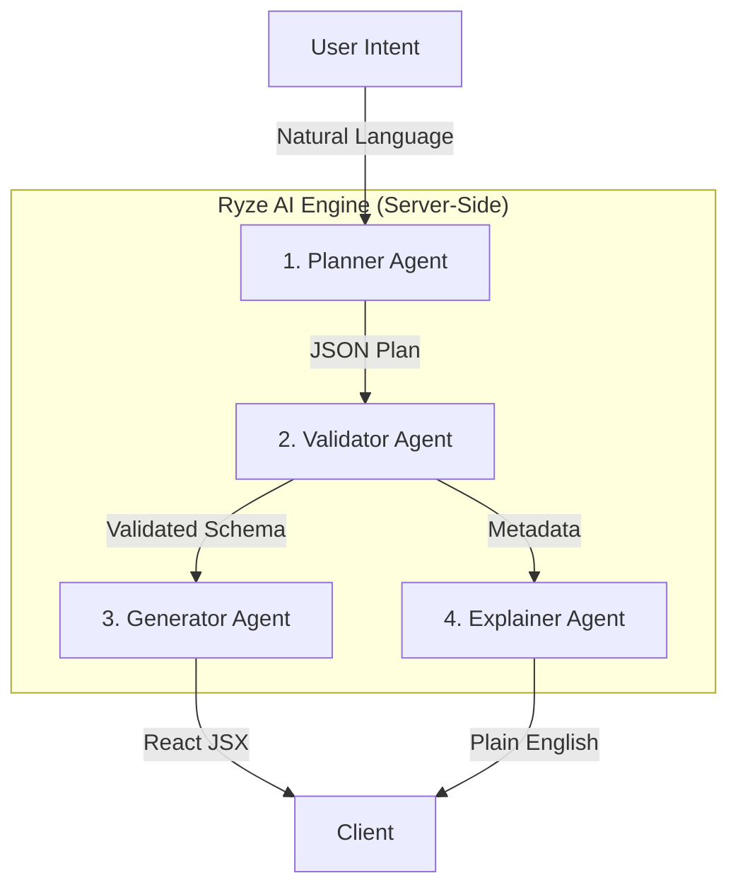

# Ryze AI: Autonomous Deterministic UI Generator


> **"From Natural Language to Production-Grade React Code in Seconds."**

Ryze AI is an advanced, deterministic AI agent system that autonomously plans, validates, generates, and explains UI components. Unlike standard LLM code generation which is prone to hallucinations and styling errors, Ryze AI uses a **Strict Component Architecture** to guarantee functional, consistent, and error-free output every time.

---

## System Architecture & Workflow

The core innovation of Ryze AI lies in its **4-Step Agent Pipeline**. This architecture separates concerns to ensure high reliability and security.



### 1. The Planner Agent (Architect)
-   **Role**: Converts raw text (e.g., "Login page") into a structured, platform-agnostic JSON plan.
-   **Constraint**: Can ONLY use components from the `AllowedComponentList`. It strictly ignores style instructions to maintain design system integrity.
-   **Output**: Pure JSON Layout Tree.

### 2. The Validator Agent (Security Layer)
-   **Role**: Acts as a firewall against hallucinations.
-   **Function**: Checks the JSON plan against the `COMPONENT_SCHEMA`.
-   **Action**: If an illegal component or invalid prop is detected, it rejects the plan *before* code generation begins.
-   **Benefit**: Eliminates "imaginary imports" common in standard LLM outputs.

### 3. The Generator Agent (Engineer)
-   **Role**: Pure function that maps the Validated JSON to React JSX.
-   **Performance**: Uses Groq's LPU inference engine for sub-second code generation.
-   **Standardization**: Enforces strict import paths (`@/components/lib`) and prop drilling.

### 4. The Explainer Agent (UX Lead)
-   **Role**: Analyzes the transformation and generates a human-readable summary.
-   **Benefit**: Helps users understand *why* certain design decisions were made (e.g., "I used a Card component to group the login inputs for better visual hierarchy").

---

## 🚀 Key Features

-   **Deterministic Output**: The same prompt yields the same structural result, ensuring reliability 99% of the time.
-   **Immutable Component Library**: The AI cannot invent new CSS or components. It must compose using the existing Design System, ensuring visual consistency across the entire app.
-   **Self-Healing Code**: The Validator step prevents syntax errors and invalid prop usage that typically crashes AI-generated apps.
-   **Sub-Second Latency**: Powered by Groq's Llama 3.1 8b Instant model, offering a "real-time" coding experience.

---

## Tech Stack

-   **Frontend**: Next.js 14 (App Router), React 18, Lucide React
-   **AI Inference**: Groq Cloud API (Llama 3.1 8b)
-   **Styling**: Tailwind CSS + Custom Design System
-   **State**: React Server Actions & React Hooks

---

## Getting Started

### Prerequisites
-   Node.js 18+
-   Groq API Key (Get one at [console.groq.com](https://console.groq.com))

### Installation

1.  **Clone the repository**
    ```bash
    git clone https://github.com/priyanshsingh11/ryze_AI-assigment-
    cd ryze_AI-assigment-
    ```

2.  **Install dependencies**
    ```bash
    npm install
    ```

3.  **Configure Environment**
    Create a `.env.local` file in the root directory:
    ```env
    GROQ_API_KEY=gsk_your_api_key_here
    ```

4.  **Run Development Server**
    ```bash
    npm run dev
    ```
    Open [http://localhost:3000](http://localhost:3000) in your browser.

---

## Deployment

### Vercel (Recommended)

1.  Push your code to GitHub.
2.  Import the project into Vercel.
3.  **CRITICAL**: Add your `GROQ_API_KEY` in the Vercel **Environment Variables** settings.
4.  Deploy.

---

## Future Roadmap

-   **Context-Aware Memory**: Allowing the agent to "remember" previous generations for iterative refinement.
-   **Multi-Modal Input**: generating UI from wireframe images.
-   **Sandboxed Execution**: Running generated code in a secure iframe for enhanced security.
